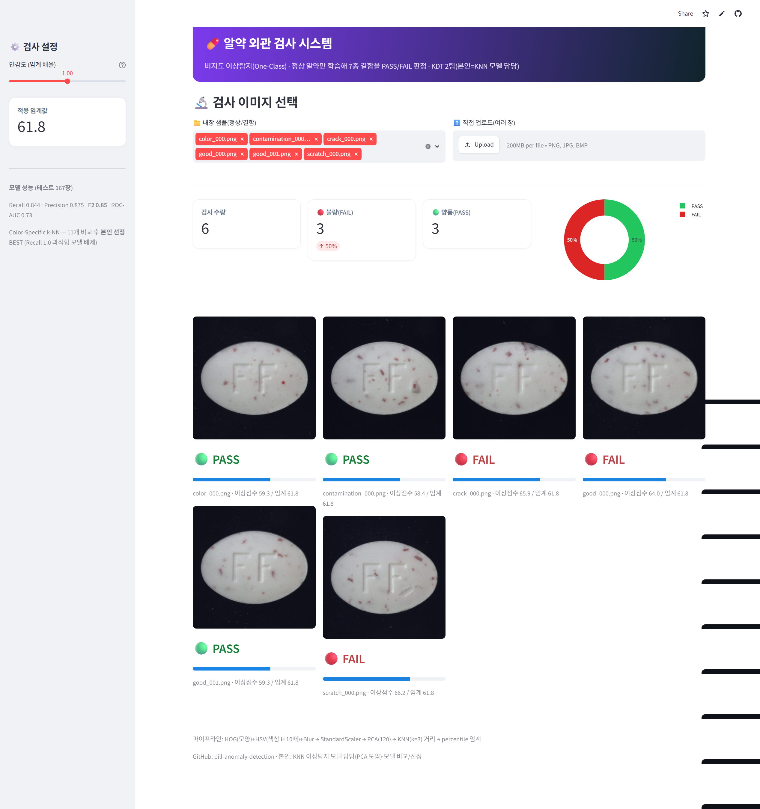
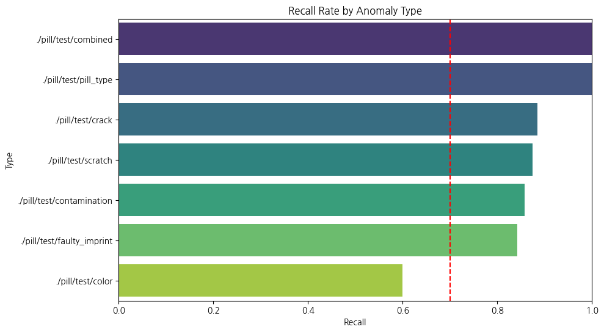
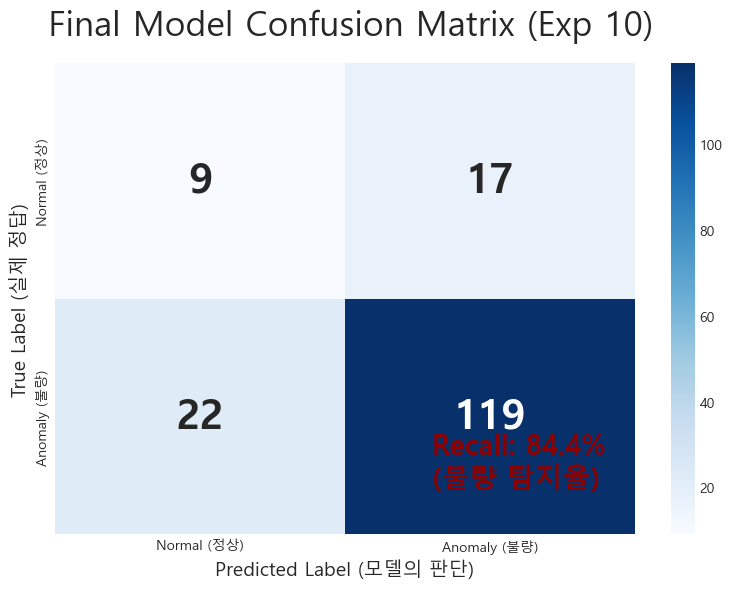
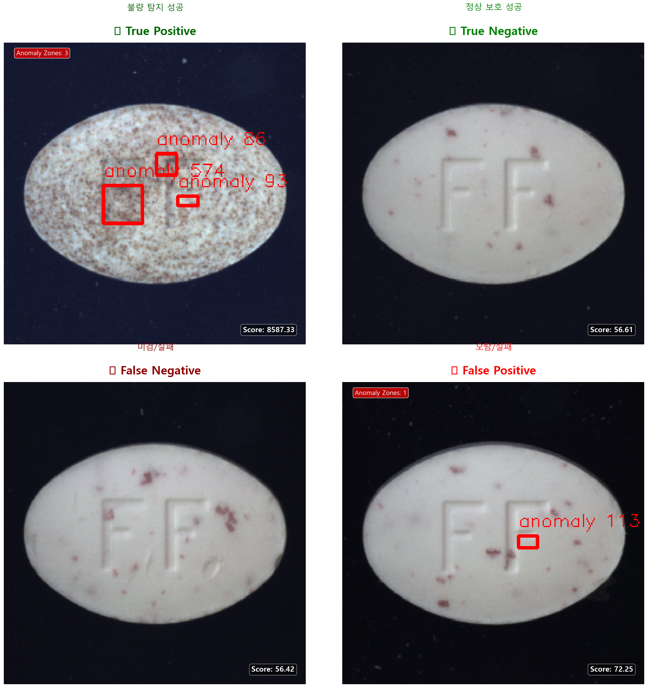

# 💊 알약 외관 검사 — 비지도 이상탐지 (KNN + PCA)

[](https://pill-anomaly-detection-azlwvnidzu4zjkahewyadp.streamlit.app/)

**🖥 [▶️ 라이브 데모 (Streamlit)](https://pill-anomaly-detection-azlwvnidzu4zjkahewyadp.streamlit.app/)** — 실제 학습 모델로 바로 구동(내장 샘플 포함)



> 정상 알약만 학습해(비지도 One-Class) 7종 결함을 잡는 이미지 이상탐지. 불량을 놓치면 치명적이라 Accuracy 대신 **Recall 가중 F2-score**로 평가. **학습된 모델로 실제 PASS/FAIL 판정하는 Streamlit 앱 포함.**

| 항목 | 내용 |
|---|---|
| 기간 | 2026.03.17 ~ 2026.03.23 |
| 팀 | 2팀 (KDT 팀 프로젝트) |
| **나의 역할** | **KNN 이상탐지 모델 담당 (PCA 도입) · 여러 모델 비교 후 BEST 선정** |

> ℹ️ KDT 부트캠프 팀 프로젝트입니다. 본 저장소는 **본인의 KNN 모델** 작업입니다.

---

## 🎯 문제 정의
알약 결함은 종류가 많고(색상·오염·균열·각인불량·스크래치 등 **7유형**) 불량 샘플이 적다 → **정상만 학습하는 비지도(OCC)**. **불량 놓침(FN)이 치명적**이라 Recall 가중 F2-score로 평가.
- 데이터: 정상 **267장** 학습 / 테스트 **167장**(정상 26 + 불량 141).

## 🧠 모델 선정 (★ 핵심 판단)
11개 KNN 변형을 비교한 결과, **"Final Weighted k-NN"이 F2 0.964·Recall 1.0**으로 가장 높아 보였으나 — 이는 임계값이 0이 되어 **"전부 불량으로 판정"하는 과적합 아티팩트**(Acc 0.844)였습니다.
→ 이를 간파하고, **실제로 변별되는 `Color-Specific k-NN`(Acc 0.766 · Recall 0.844 · Precision 0.875 · F2 0.85)을 BEST로 선정**했습니다. *(높은 점수 뒤의 함정을 의심하는 판단)*

## 🛠 기술 스택
`Python` · `scikit-learn` · `KNN(k=3)` · `PCA(120)` · `HOG / HSV / GLCM` · `OpenCV`

## 🔧 핵심 구현 (BEST: Color-Specific k-NN)
1. **특징 추출** — HOG(모양) + HSV 색상 히스토그램(**H 64-bin × 10배 가중**, S × 5배) + Gaussian Blur.
2. **전처리** — StandardScaler로 스케일 정합.
3. **PCA(120)** — 고차원 특징 압축.
4. **KNN(k=3)** — 정상만 학습 후 3-최근접 평균 거리 = 이상점수, 정상분포 85 percentile 임계.

## 🔧 트러블슈팅
| 문제 | 해결 |
|---|---|
| 색상 결함 미검출(HOG는 모양만) | HSV(H 64-bin·10배 가중) 추가 |
| 차원의 저주 | PCA(120) 차원축소 |
| 지표 함정(F2 0.964=전부 불량) | 과적합 간파 → 변별되는 BEST(F2 0.85) 선정 |
| 색상 결함 recall 낮음 | 가중치 상향(부분 개선, 여전히 한계) |

## 📈 결과
- **Color-Specific k-NN: Acc 0.766 · Recall 0.844 · Precision 0.875 · F2 0.85 · ROC-AUC 0.73.**
- 한계(정직): 색상·오염 결함은 비지도 이상탐지로 잡기 어려워 일부 놓침(개선과제).

## 📊 실험 결과 & 시각화

11개 KNN 변형 비교 (F2-score 기준):

| 모델 | 전처리 | Acc | Recall | F2 |
|---|---|---|---|---|
| k-NN Baseline | HOG only | 0.62 | 0.57 | 0.62 |
| Final Weighted k-NN | Blur+가중 Color | 0.84 | **1.00** | 0.964 ⚠️과적합(전부 불량) |
| **★ Color-Specific k-NN (BEST)** | **H(64)+가중10x, PCA120** | **0.766** | **0.844** | **0.85** |

> ⚠️ Final Weighted는 임계 0으로 "전부 불량 판정"하는 과적합 → **배제**하고 실제 변별되는 Color-Specific를 본인이 BEST로 선정.

<p>
 
</p>
<p>
 
</p>

> 좌상: 모델별 F2 비교 · 우상: 결함 유형별 Recall · 좌하: 혼동행렬 · 우하: 결함 7종 예시

## 🖥 데모 (Streamlit) — 실모델 구동
업로드한 알약 이미지를 **학습된 Color-Specific k-NN으로 실제 PASS/FAIL 판정**(여러 장 배치 + 민감도 조절).
```bash
pip install -r requirements.txt
streamlit run app.py
```

## 📁 구조
```
app.py                   # 산업용 검사 UI (실모델 PASS/FAIL 판정)
pill_knn_anomaly.ipynb   # 본인 작업: 특징추출·PCA·KNN·모델 비교 전 과정
models/                  # 학습 산출물(scaler·PCA·정상뱅크·임계) — 앱이 로드
requirements.txt
```
> 알약 원본 데이터셋은 용량 관계로 제외. 모델은 정상 267장으로 학습한 산출물을 포함.
